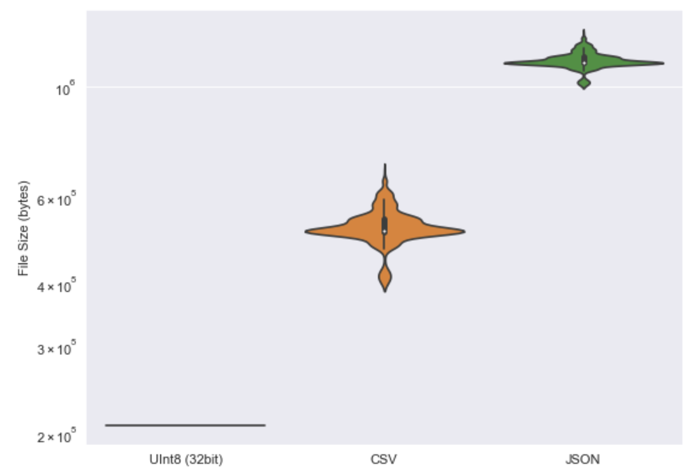

# census-data
Processed data for the census atlas app

## File style and processing 

|             | i_CSV    | i_JSON   | i_Uint    | l_Uint    |
|:------------|:---------|:---------|:----------|:----------|
| Compute ∆ | 1.5      | 1.6      | 2.29      | 33.2      |
| ∑ size      | 751.1 MB | 1.6 GB   | 298.5 MB  | 298.5 MB  |
| µ size      | 512.4 KB | 1.1 MB   | 203.6 KB  | 8.8 KB    |
| std size    | 40.4 KB  | 40.4 KB  | 0.0 bytes | 0.0 bytes |
| # files     | 1501     | 1501     | 1501      | 34753     |

Note: binary file sizes all have the same number of allocated slots for each element, and therefore will not have any variance for equally sized datasets. 


## Total FILE TYPE distrubutions 
Some research into the different file types we can use to load the data. 




## Usage in JS
The binary files can be obtained using the fetch api. 
```js
url = 'https://raw.githubusercontent.com/wolfiex/census-data/main/test.buffer'
fetch(url)
    .then(response => response.arrayBuffer())
    .then(data=> newdata = new Uint16Array(data))
```


## Data location
See the `./data` folder.

To recompute these you must first create the hdf5 file, and then run `makeFlatfiles.py`.


## source: 
Data moved from `./census-atlas` submodule into `lsoa` folder for converting into a hdf5 file. (3GB - excluded)

This is done using `makeHDF.py`


